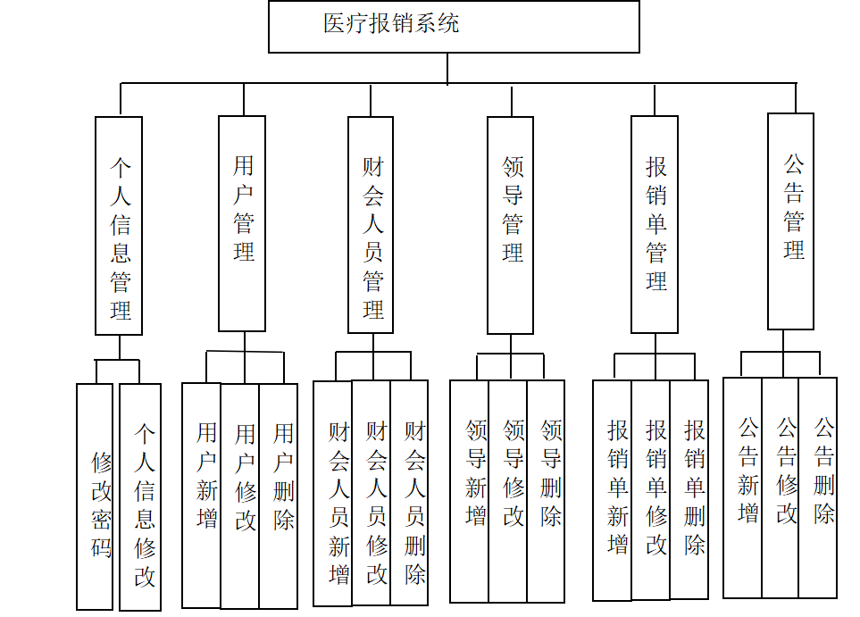
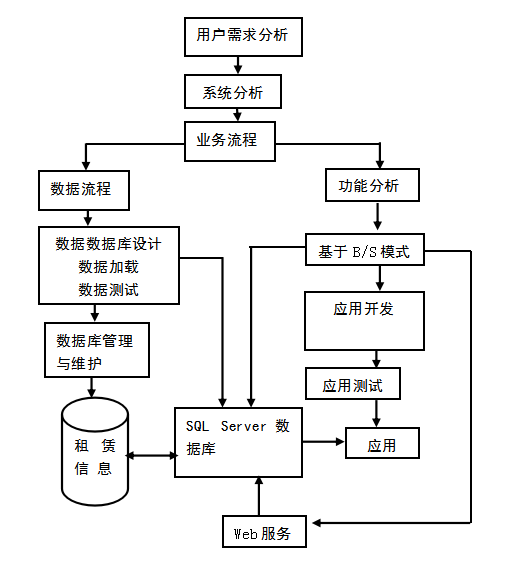
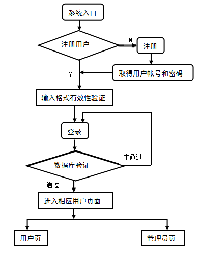
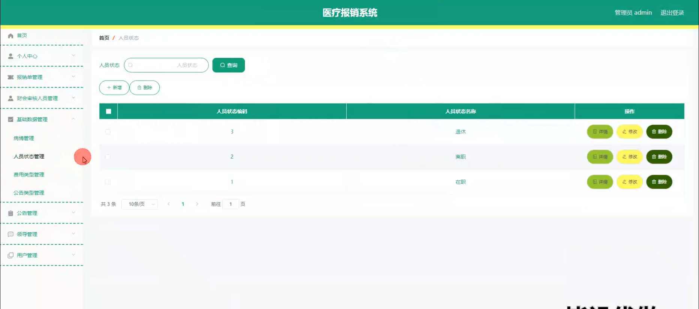

# 毕业设计精选-基于springboot的医疗报销系统的设计与实现

<h4 style='color:red'>联系不到我，就看我的主页 </h4> 
 
#### 系统概要

基于Spring Boot的医疗报销系统是一款旨在简化和自动化医疗费用报销流程的应用程序。该系统设计了四种角色：管理员、领导、财会审核人员和用户，每个角色对应不同的功能模块，以满足其特定的需求和操作权限。通过该系统，用户可以方便地提交报销申请，财会审核人员可以高效地进行审核，领导可以管理和监督报销单的处理，管理员则负责整体系统的管理和维护。

#### 研究背景

信息数据从传统到当代，是一直在变革当中，突如其来的互联网让传统的信息管理看到了革命性的曙光，因为传统信息管理从时效性，还是安全性，还是可操作性等各个方面来讲，遇到了互联网时代才发现能补上自古以来的短板，有效的提升管理的效率和业务水平。传统的管理模式，时间越久管理的内容越多，也需要更多的人来对数据进行整理，并且数据的汇总查询方面效率也是极其的低下，并且数据安全方面永远不会保证安全性能。结合数据内容管理的种种缺点，在互联网时代都可以得到有效的补充。结合先进的互联网技术，开发符合需求的软件，让数据内容管理不管是从录入的及时性，查看的及时性还是汇总分析的及时性，都能让正确率达到最高，管理更加的科学和便捷。本次开发的医疗报销系统实现了医疗报销系统报销单管理、财会审核人员管理、字典管理、公告管理、领导管理、用户管理、管理员管理等功能。系统用到了关系型数据库中王者MySql作为系统的数据库，有效的对数据进行安全的存储，有效的备份，对数据可靠性方面得到了保证。并且程序也具备程序需求的所有功能，使得操作性还是安全性都大大提高，让医疗报销系统更能从理念走到现实，确确实实的让人们提升信息处理效率。

#### 技术栈

后端技术栈：Springboot+Mysql+Maven

前端技术栈：Vue+Html+Css+Javascript+ElementUI

开发工具：Idea+Vscode+Navicate

#### 系统功能介绍

管理员角色  
个人中心：管理员可以在个人中心查看和更新个人信息，修改密码等。  
财会审核人员管理：管理员负责管理财会审核人员的信息，包括添加、删除和更新审核人员信息。  
基础数据管理：管理员可以管理系统的基础数据，如报销项目类别、费用标准等。   
公告管理：管理员可以发布和管理系统公告，确保所有用户及时了解最新信息。   
领导管理：管理员可以管理领导的信息，包括添加、删除和更新领导信息。  
用户管理：管理员负责管理普通用户的信息，包括注册审核、权限分配和信息维护等。  

领导角色  
个人中心：领导可以在个人中心查看和更新个人信息，修改密码等。  
报销单管理：领导可以查看和审批报销单，了解报销的详细情况，并进行审批或退回处理。  
财会审核人员管理：领导可以查看和管理财会审核人员的信息。  
公告管理：领导可以查看和发布系统公告。  
用户管理：领导可以查看用户信息，了解用户的报销情况和历史记录。  

财会审核人员角色  
个人中心：财会审核人员可以在个人中心查看和更新个人信息，修改密码等。  
报销单管理：财会审核人员负责审核用户提交的报销单，检查报销金额和项目是否符合规定，并进行审批或退回处理。  
公告管理：财会审核人员可以查看系统公告，了解最新的政策和通知。  

用户角色  
个人中心：用户可以在个人中心查看和更新个人信息，修改密码等。  
报销单管理：用户可以在线提交报销单，填写报销项目和金额，并上传相关证明材料，查看报销单的处理状态和历史记录。  
公告管理：用户可以查看系统公告，了解最新的政策和通知。  

#### 系统模块设计

医疗报销系统系统在进行系统中功能模块的划分时，采用层次图来进行表示。层次图具有树形结构，它能使用矩形框来描绘数据信息。顶层代表的数据结构很完整，顶层下面的矩形框表示的数据就是子集数据，当然处于最下面的矩形框就是不能再进行细分的数据元素了，使用层次方框图描述系统功能能让用户一目了然，能够明白系统的功能，以及对应功能板块下面的子功能都可以清楚领会。医疗报销系统分为管理员和用户两部分操作角色，下面将对他们的功能进行阐述。
管理员可以管理用户的基本信息，可以管理等功能。管理员功能结构图如下：

#### 系统流程分析

医疗报销系统的开发也是有对应的流程，开发之前必须要进行用户功能需求的分析，最后根据功能需求进行网站设计还有数据库相关数据的设计工作，此次开发的医疗报销系统开发流程如下：

系统开发完成之后会给用户提供登录入口，在这个界面用户输入的信息会得到验证，通过验证之后才能进去医疗报销系统的访问主界面，系统登录执行流程如下：

#### 系统作用

该医疗报销系统的主要作用包括：

提高报销效率：通过系统自动化处理，减少手工操作，提高报销单的处理速度。  
减少人为错误：系统提供标准化的报销流程和审核机制，降低数据录入和处理过程中的人为错误。  
增强透明度：用户可以实时查看报销单的处理状态和历史记录，增强报销流程的透明度。  
便捷的管理功能：管理员、领导和财会审核人员可以方便地管理各自职责范围内的工作，提高管理效率。  
信息安全：系统采用先进的技术手段，确保用户数据的安全性和隐私保护。  

#### 系统功能截图

登录

报销单管理

公告管理

人员状态管理

用户管理

领导管理

领导端财会审核人员管理

财会审核人员端报销单管理

用户端报销详情

#### 总结

基于Spring Boot的医疗报销系统在设计和实现过程中，充分考虑了现有医疗报销流程中的各种问题，提供了一套高效、便捷、安全的解决方案。通过该系统，不仅可以提高报销效率，减少人为错误，还能增强透明度和信息安全性，为用户提供更优质的服务。未来，随着系统的不断完善和功能的扩展，该医疗报销系统将能够更好地满足医疗机构和员工的需求，为医疗管理信息化建设做出积极贡献。

#### 使用说明

创建数据库，执行数据库脚本 修改jdbc数据库连接参数 下载安装maven依赖jar 启动idea中的springboot项目

后台登录页面
http://localhost:8080/yiliaobaoxiaoxitong/admin/dist/index.html

管理员				账户:admin 		密码：admin

财会审核人员				账户:a1 		密码：123456

领导				账户:a1 		密码：123456

用户				账户:a1 		密码：123456
